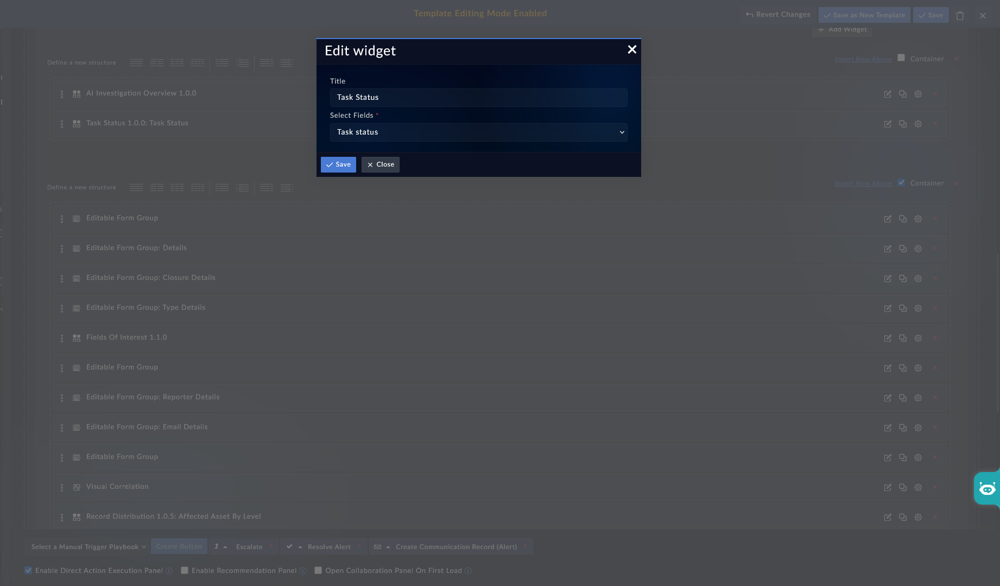

| [Home](../README.md) |
| -------------------- |

# Installation

1. In FortiSOAR, navigate to **Content Hub** > **Discover**.
2. From the list of widgets, search for **Task Status**.
3. Click the **Task Status** widget card.
4. Click **Install** at the bottom of the card to begin installation.

# Configuration

To configure the **Task Status** widget:

1. Navigate to the record detail view where you want to add the widget.
2. Click **Edit Template** to open the template editor.
3. Click **Add Widget** and select **Task Status** from the list.
4. The **Edit widget** configuration form opens. Fill in the fields described in this section.
5. Click **Save** to apply the configuration.

## Title

Enter a display name for the widget. This title appears in the widget header on the record detail view. For example, enter `Task Status` to use the widget name as the header.

## Select Fields

Select the field whose value the widget reads to display tasks. The dropdown lists only fields of type `object` on the current module — for example, **Task status** on the Alerts module. The selected field must contain a JSON value in the structure the widget expects.

> [!NOTE]
> The field value must be populated externally — by a playbook, via the FortiSOAR REST API, or by editing the field directly on the record. The widget reads and displays the value; it does not write to it.

## Next Steps

| [Usage](./usage.md) |
| ------------------- |