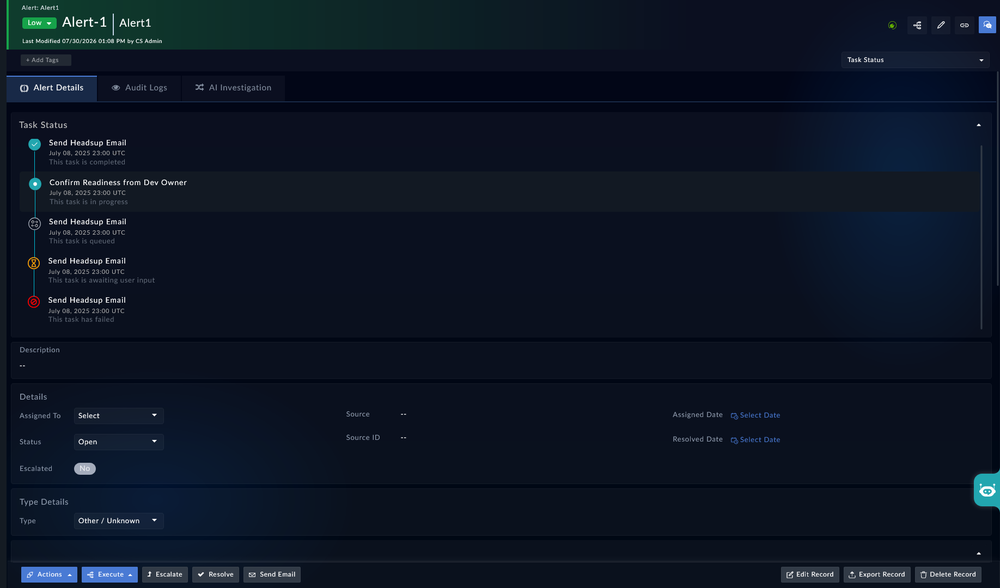

| [Home](../README.md) |
| -------------------- |

# Usage

Once added and configured on a record's detail view, the **Task Status** widget renders a vertical timeline of tasks, reading its data from the field selected during configuration. The widget updates in real time whenever the field value changes — for example, when a playbook updates the task list during execution.

## What the Widget Displays

Each entry in the timeline corresponds to one task and displays the following information:

- **Status icon** — a visual indicator of the task's current status
- **Title** — the name of the task
- **Timestamp** — the date and time of the last status update
- **Description** — a brief description of the task or its current state

The following task statuses are supported:

| Status              | Icon                                                          |
|---------------------|---------------------------------------------------------------|
| Completed           |  |
| In Progress         |  (row is highlighted)                         |
| Queued              |                                             |
| Awaiting User Input | |
| Failed              | |                                                      |

The in-progress task row is visually highlighted to draw attention to the current active task.

## Example — Task Status on an Alert

When added to the **Alerts** detail view, the **Task Status** widget can display a sequence of response tasks associated with an alert. A playbook running against the alert can populate the **Task status** field with a JSON payload, which the widget reads and renders as a timeline.

The following is an example of what the widget displays when the **Task status** field is populated:

In this example:

- **Send Heads up Email** — completed
- **Confirm Readiness from Dev Owner** — in progress (row is highlighted)
- **Send Heads up Email** — queued
- **Send Heads up Email** — awaiting user input
- **Send Heads up Email** — failed

## Next Steps

| [Installation](./setup.md#installation) | [Configuration](./setup.md#configuration) |
| --------------------------------------- | ----------------------------------------- |